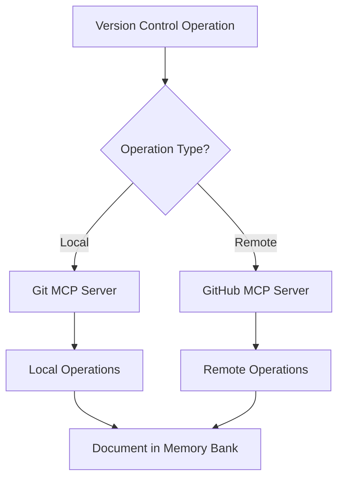

# System Patterns

This document outlines the core architectural patterns and system design principles that support our Next.js development environment. The patterns ensure systematic, efficient, and maintainable development processes while facilitating clear error handling and effective progress tracking.

Key aspects include:

- Next.js application architecture
- Error handling patterns
- Development workflow patterns
- Quality assurance mechanisms

## Architecture Overview

The system architecture is designed to support efficient Next.js 15+ development through:

1. **Next.js 15+ Architecture**
   - Server-first component hierarchy
   - Advanced routing system with Server Components
   - Distributed state management between Server and Client
   - API integration through Server Components

2. **Rendering Architecture**
   - Static Rendering (Default): Build-time pre-rendering
   - Dynamic Rendering: Request-time rendering
   - Streaming: Progressive chunk-based rendering
   - Hybrid rendering strategies

3. **Development Infrastructure**
   - Error handling system
   - Testing framework
   - Build pipeline
   - Deployment workflow

4. **Core Architecture Principles**
   - Modularity and separation of concerns
   - Component reusability
   - Performance optimization
   - Error resilience

## CSS Architecture Patterns

The system implements modern CSS patterns using Tailwind CSS v4.0+:

1. **CSS-First Configuration**
   - [!TAILWIND-V4] Design tokens defined via `@theme` directive
   - Native cascade layers for specificity control
   - [!TAILWIND-V4] Registered custom properties for animations
   - Modern CSS features integration
   - [!TAILWIND-V4] Zero-configuration approach
   - [!PERFORMANCE] Performance-optimized compilation

2. **Component-Level Responsiveness**
   - [!TAILWIND-V4] Container queries for modular design
   - [!TAILWIND-V4] `@container` syntax implementation
   - Composable breakpoint patterns
   - Adaptive component layouts
   - Responsive state handling
   - Dynamic scaling strategies

3. **Modern Style Patterns**
   - [!TAILWIND-V4] Color manipulation via `color-mix()`
   - [!TAILWIND-V4] Advanced gradient implementations
   - [!TAILWIND-V4] 3D transform utilities
   - Arbitrary value support
   - [!TAILWIND-V4] Shorthand opacity syntax
   - Enhanced animation capabilities

4. **Build and Performance Optimization**
   - [!PERFORMANCE] Rust-based high-performance engine
   - [!TAILWIND-V4] Incremental builds for faster development
   - [!TAILWIND-V4] Automatic content detection
   - [!PERFORMANCE] Unified toolchain with Lightning CSS
   - [!PERFORMANCE] Optimized bundle size management

5. **Migration and Compatibility**
   - [!MIGRATION] Breaking changes handled (see memory-bank/tailwind-v4.md)
   - [!MIGRATION] Deprecated utility replacements
   - Browser compatibility considerations
   - Progressive enhancement strategies

## Component Library Patterns

The system implements specific patterns for shadcn/ui and supporting UI libraries:

1. **shadcn/ui Integration with Tailwind v4.0**
   - Copy-paste implementation approach
   - Individual component installation
   - Tailwind CSS integration
   - Radix UI primitive foundation
   - Accessibility-first components
   - Server/Client component separation
   - TypeScript type safety

2. **Component Customization**
   - Tailwind CSS modifications
   - Theme configuration
   - Component variants
   - Style overrides
   - Animation patterns
   - Responsive design

3. **Library Composition**
   - shadcn/ui primary components
   - Headless UI supplementary components
   - Radix UI primitive integration
   - Custom component development
   - Component composition strategies

## Design Patterns

The system implements patterns that support effective Next.js 15+ development:

1. **Bundling Patterns**
   - Module dependency management
   - Environment-specific code splitting
   - Tree-shaking optimization
   - Route-based code organization

2. **Server Component Patterns**
   - Default rendering strategy implementation
   - Direct data access and API integration
   - Secure sensitive data handling
   - Server-side computation optimization
   - Pre-rendering and caching strategies
   - Environment variable access patterns
   - Database connection management

3. **Client Component Patterns**
   - File-level 'use client' directive placement
   - Module import chain management
   - Entry point optimization
   - Browser API integration strategies
   - User interaction handling
   - Local state management
   - DOM manipulation patterns

4. **Network Boundary Patterns**
   - Type-safe cross-boundary communication
   - Server-to-Client reference handling
   - Client-to-Server action management
   - Data serialization strategies
   - Error handling across boundaries
   - Performance optimization techniques

5. **Composition Patterns**
   - Server Component prop passing
   - Client Component nesting rules
   - Context provider integration
   - Error boundary placement
   - Single-pass rendering optimization
   - Waterfall prevention strategies
   - Progressive enhancement implementation

6. **Error Handling Patterns**
   - Error boundaries
   - Error logging
   - Recovery strategies
   - Debug workflows

7. **System Patterns**
   - Repository Pattern for data access
   - Factory Pattern for component creation
   - Observer Pattern for state updates
   - Strategy Pattern for error handling

## Component Structure

The system implements a structured component hierarchy optimized for Next.js 15+:

1. **Server Components (Default)**
   - Route Entry Points:
     - Static pages and layouts
     - Dynamic route handlers
     - API endpoints
   - Data Components:
     - Database query components
     - API integration components
     - File system handlers
   - Computation Components:
     - Data transformation logic
     - Business rule processors
     - Secure operation handlers
   - Pre-rendering Components:
     - Static content generators
     - Cache management components
     - Build-time optimizers

2. **Client Components (Interactive)**
   - User Interface Components:
     - Interactive UI elements
     - Form handling components
     - Animation controllers
   - State Components:
     - Local state managers
     - Context providers
     - Effect handlers
   - Browser Integration:
     - DOM event handlers
     - Browser API wrappers
     - Storage managers
   - Error Management:
     - Client-side error boundaries
     - Fallback UI components
     - Recovery handlers

3. **Composition Components**
   - Integration Components:
     - Server-Client bridges
     - Props passage handlers
     - Reference management
   - Optimization Components:
     - Performance wrappers
     - Loading boundaries
     - Streaming handlers
   - Utility Components:
     - Shared functionality
     - Common patterns
     - Reusable logic
   - Error Components:
     - Boundary containers
     - Recovery handlers
     - Fallback providers

4. **Development Components**
   - Error handlers
   - Testing utilities
   - Debug tools
   - Monitoring systems

5. **Core System Structure**
   - **pages/**: Next.js pages
   - **components/**: Reusable components
   - **styles/**: CSS and styling
   - **public/**: Static assets
   - **lib/**: Utility functions
   - **tests/**: Test files
   - **memory-bank/**: Documentation

## Code Conventions

Conventions supporting Next.js 15+ development:

1. **Server Component Standards**
   - Default server-side rendering
   - Direct backend integration
   - Environment variable usage
   - Security-first implementation

2. **Client Component Standards**
   - 'use client' directive placement
   - Minimal client-side JavaScript
   - Browser API integration
   - Event handling patterns

3. **Component Composition Standards**
   - Server-to-Client data flow
   - Props-based integration
   - Error boundary placement
   - Performance optimization patterns

4. **Error Handling Practices**
   - Error boundary implementation
   - Error logging patterns
   - Recovery procedures
   - Debug protocols

5. **Language-Specific Standards**
   - **TypeScript:**
     - Strict type checking
     - Interface definitions
     - Type declarations
     - Error types

   - **React/Next.js:**
     - Component patterns
     - Hook usage
     - State management
     - Error handling

   - **CSS/SCSS:**
     - Module usage
     - Style organization
     - Component styling
     - Responsive design

## Task Execution

Systematic task execution supporting Next.js development:

1. **Development Process**
   - Component creation
   - Route implementation
   - Error handling
   - Testing procedures

2. **Error Management**
   - Error detection
   - Debug process
   - Resolution workflow
   - Documentation update

3. **Execution Framework**
   - Development commands
     - Next.js CLI
     - Testing tools
     - Build process
   - Non-destructive operations
     1. Implementation
     2. Testing
     3. Error handling
     4. Documentation
     5. Review process

## Maintenance Guidelines

Guidelines ensuring sustainable Next.js development:

1. **Development Maintenance**
   - Component updates
   - Error handling review
   - Performance optimization
   - Documentation updates

2. **Error Management**
   - Error monitoring
   - Debug efficiency
   - Resolution tracking
   - Pattern improvement

3. **System Maintenance**
   - **Purpose:** Maintain development excellence
   - **Core Principles:**
     - **Regular Review:** Assess and update components
     - **Error Handling:** Improve error management
     - **Documentation:** Clear structure
     - **Performance:** Optimize regularly

## Version Control Patterns

The system implements standardized patterns for version control using MCP servers and Conventional Commits 1.0.0:

### MCP Server Integration Patterns

#### Local vs. Remote Operations



1. Git MCP Server (Local Repository Operations):
   - Repository state management
   - Staging and commit operations
   - Local branch management
   - History and diff operations
   - File tracking and monitoring

2. GitHub MCP Server (Remote Repository Operations):
   - Remote repository interactions
   - Pull request management
   - Issue tracking and search
   - Remote branch operations
   - Repository settings management

#### Error Handling and Recovery

1. Operation Validation:
   - Pre-execution permission checks
   - Token scope verification
   - Rate limit monitoring
   - Resource availability validation

2. Error Recovery Patterns:
   - API failure recovery with exponential backoff
   - Authentication error handling
   - Rate limit management
   - Conflict resolution procedures

3. Cross-Server Coordination:
   - Operation routing based on context
   - Synchronized error handling
   - Unified documentation approach
   - Pattern-based decision making

### Conventional Commits Implementation

1. **Commit Message Structure**
   - Type with Emoji (Required)
   - Scope (Optional)
   - Breaking Change Indicator (Optional)
   - Description (Required)
   - Body (Optional)
   - Footer (Optional)

2. **Standard Types and Emojis**

   ```text
   feat:     ✨ (sparkles) New features
   fix:      🐛 (bug) Bug fixes
   docs:     📚 (books) Documentation changes
   style:    💄 (lipstick) Code style/formatting
   refactor: ♻️ (recycle) Code refactoring
   test:     🧪 (test tube) Test additions/updates
   chore:    🔧 (wrench) Maintenance tasks
   perf:     ⚡️ (zap) Performance improvements
   ci:       👷 (construction worker) CI/CD changes
   build:    📦 (package) Build system changes
   ```

3. **Scope Definitions**

   ```text
   (core)     - Core functionality
   (docs)     - Documentation systems
   (test)     - Testing infrastructure
   (ci)       - CI/CD pipeline
   (deps)     - Dependencies
   (mcp)      - MCP server related
   (memory)   - Memory Bank system
   ```

4. **Breaking Change Patterns**
   - Standard Indicator: ❗(exclamation)
   - Usage: `type(scope)!: emoji ❗ description`
   - Footer Format: `BREAKING CHANGE: description`

5. **Evolution Guidelines**
   - New types and scopes must be documented
   - Emoji-type mappings must remain consistent
   - Changes must be tracked in Memory Bank
   - Pattern modifications require team review

6. **AI-Assisted Commit Validation Framework**

   ```mermaid
   graph TD
      A[New Commit] --> B[AI Pattern Analysis]
      B --> C[Historical Validation]
      C --> D{Pattern Match?}
      D -->|Yes| E[Proceed with Commit]
      D -->|No| F[Pattern Learning]
      F --> G[Suggest Improvements]
      G --> H{Accept Changes?}
      H -->|Yes| E
      H -->|No| I[Document Deviation]
      I --> J[Update Pattern DB]
   ```

   - Pre-commit message analysis
   - Pattern-based validation rules
   - Historical context verification
   - Automated improvement suggestions
   - Pattern learning and evolution
   - Decision tracking and documentation

7. **MCP Pre-Execution Validation System**

   ```mermaid
   graph TD
      A[MCP Operation Request] --> B[Token Validation]
      B --> C[Rate Limit Check]
      C --> D[Permission Verification]
      D --> E{All Checks Pass?}
      E -->|Yes| F[Execute Operation]
      E -->|No| G[Handle Failure]
      G --> H[Document Error]
      H --> I[Update Patterns]
      I --> J[Retry Strategy]
   ```

   - Comprehensive pre-execution checks
   - Token and permission validation
   - Rate limit monitoring and management
   - Resource availability verification
   - Error pattern documentation
   - Recovery strategy implementation

8. **AI-Driven Documentation Automation**

   ```mermaid
   graph TD
      A[Operation Execution] --> B[Pattern Detection]
      B --> C[Auto-Documentation]
      C --> D[Historical Analysis]
      D --> E[Pattern Learning]
      E --> F[Documentation Update]
      F --> G[Memory Bank Sync]
      G --> H[Verification]
   ```

   - Self-improving documentation protocols
   - Pattern-based content generation
   - Historical context preservation
   - Error pattern learning
   - Knowledge base evolution
   - Cross-reference maintenance

9. **Integration with Sequential Thinking MCP**
   - AI-guided decision workflows
   - Problem decomposition patterns
   - Solution exploration frameworks
   - Error mitigation strategies
   - Pattern-based learning
   - Documentation automation
   - Cross-MCP coordination

## Sequential Thinking Patterns with AI Support

The system implements structured patterns for problem-solving using the Sequential Thinking MCP server:

1. **Thought Process Structure**
   - Linear Progression:
     - Clear initial problem definition
     - Step-by-step decomposition
     - Context-aware analysis
     - Solution hypothesis generation
   - Branching Patterns:
     - Alternative path exploration
     - Decision tree development
     - Solution comparison
     - Error mitigation strategies

2. **Problem-Solving Frameworks**
   - Architecture Planning:
     - System design breakdown
     - Component interaction analysis
     - Integration strategy development
     - Error handling design
   - Implementation Planning:
     - Feature decomposition
     - Task sequencing
     - Dependency mapping
     - Risk assessment

3. **Revision Patterns**
   - Iterative Refinement:
     - Previous thought reconsideration
     - New context incorporation
     - Solution adjustment
     - Error pattern resolution
   - Branch Management:
     - Alternative solution exploration
     - Parallel path analysis
     - Option comparison
     - Decision validation

4. **Documentation Standards**
   - Thought Recording:
     - Clear step numbering
     - Context preservation
     - Decision rationale
     - Error consideration
   - Progress Tracking:
     - Completion assessment
     - Branch documentation
     - Solution verification
     - Error pattern documentation

## Modularity and Scalability

Architecture supporting flexible Next.js development with AI assistance:

1. **Component Modularity**
   - AI-validated independent components
   - AI-suggested reusable patterns
   - Clear interfaces with AI validation
   - Automated error isolation
   - AI-assisted refactoring

2. **Error System Scalability**
   - AI-enhanced error handling
   - Automated recovery procedures
   - AI-driven pattern adaptation
   - Proactive monitoring
   - Self-improving error detection

3. **Core System Design**
   - AI-optimized modular architecture
   - Automated separation of concerns
   - AI-enhanced error resilience
   - AI-driven performance optimization
   - Future expansion with AI support
   - Solo developer efficiency focus

4. **AI Integration Framework**
   - Continuous learning system
   - Pattern recognition automation
   - Decision support system
   - Quality assurance automation
   - Documentation generation
   - Context preservation protocols

## Protocol Enforcement Patterns

1. **Confidence Assessment Pattern**

   ```mermaid
   graph TD
      A[Tool Use Request] --> B[Pre-Use Confidence]
      B --> C[Reasoning Documentation]
      C --> D[Tool Execution]
      D --> E[Result Assessment]
      E --> F[Post-Use Confidence]
      F --> G[Pattern Learning]
   ```

2. **Error Detection Pattern**

   ```mermaid
   graph LR
      A[Pre-Change Check] --> B[Workspace Diagnostics]
      B --> C[Error Documentation]
      C --> D[Implementation]
      D --> E[Post-Change Check]
      E --> F[Results Comparison]
      F --> G[Issue Tracking]
   ```

3. **Protocol Compliance Pattern**
   - Pre-action verifications
   - Process compliance checks
   - Post-action validations
   - Continuous monitoring
   - Pattern enforcement
   - Rule adherence tracking

4. **Resolution Workflow Pattern**
   - Systematic issue identification
   - Priority-based scheduling
   - Incremental resolution
   - Validation checkpoints
   - Documentation updates
   - Progress tracking
