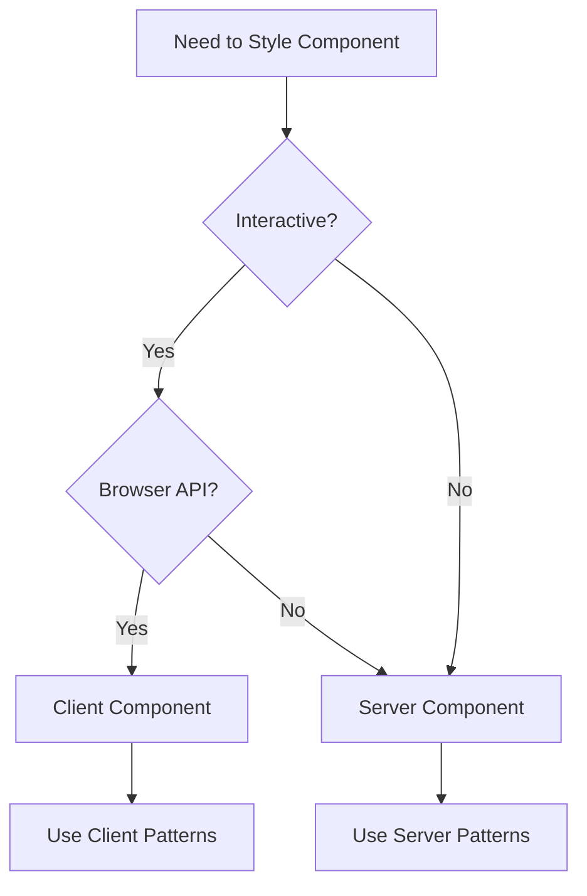
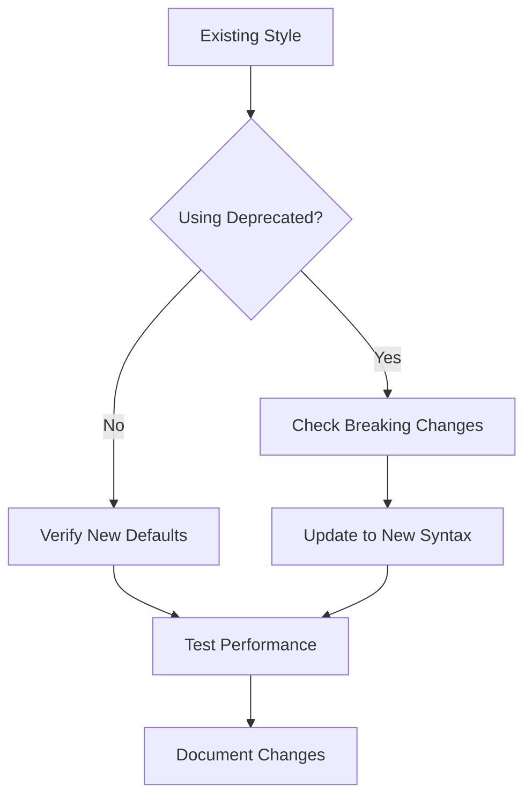

# Tailwind CSS v4.0+ Reference Guide

This document serves as the authoritative reference for Tailwind CSS v4.0+ features, changes, and implementation patterns. It is designed for quick reference and decision-making during development.

## Quick Reference

### Breaking Changes

| Category | Change | Action Required |
|----------|--------|-----------------|
| Configuration | JavaScript to CSS-first | Use `@theme` directive |
| Deprecated Utilities | Removed opacity classes | Use shorthand (e.g., `bg-black/50`) |
| Class Renames | `shadow-sm` → `shadow-xs` | Update class names |
| Package Structure | Separate CLI/PostCSS packages | Update dependencies |
| Default Behaviors | Ring width now 1px | Use `ring-3` for old default |

### New Features Matrix

| Feature | Use Case | Example |
|---------|----------|---------|
| Container Queries | Component-level responsiveness | `@container` syntax |
| Color System | Modern color manipulation | `color-mix()` |
| 3D Transforms | Advanced animations | `rotate-x-*`, `scale-z-*` |
| Dynamic Values | Flexible utilities | `grid-cols-[15]` |
| Not Variant | Negative conditions | `not-last:border-b` |

## Decision Trees

### Styling Approach



### Migration Path



## Implementation Patterns

### CSS-First Configuration

```css
@import "tailwindcss";

@theme {
  --color-primary: oklch(0.84 0.18 117.33);
  --font-display: "Satoshi", sans-serif;
  --breakpoint-3xl: 1920px;
}
```

### Modern Component Patterns

```jsx
// Container Query Example
<div class="@container">
  <div class="grid grid-cols-1 @sm:grid-cols-3 @lg:grid-cols-4">
    {/* Content */}
  </div>
</div>

// Color & Opacity
<div class="bg-primary/50 text-black/75">
  {/* Content */}
</div>

// 3D Transforms
<div class="rotate-x-12 scale-z-110 perspective-1000">
  {/* Content */}
</div>
```

## Performance Optimization

### Build Process

- Use zero-configuration content detection
- Leverage incremental builds
- Implement proper caching strategies

### CSS Generation

- Minimize variant usage
- Use dynamic values judiciously
- Monitor bundle size

## Browser Compatibility

### Feature Support Matrix

| Feature | Modern Browsers | Legacy Support | Fallback |
|---------|----------------|----------------|----------|
| Container Queries | Full | Partial | Media queries |
| Color Functions | Full | Limited | RGB fallbacks |
| 3D Transforms | Full | Yes | 2D transforms |

## Migration Checklist

### Pre-Migration

- [ ] Audit existing styles
- [ ] Document deprecated usage
- [ ] Backup configurations
- [ ] Set up version control

### During Migration

- [ ] Update configuration to CSS-first
- [ ] Replace deprecated utilities
- [ ] Update class names
- [ ] Test components

### Post-Migration

- [ ] Verify performance
- [ ] Update documentation
- [ ] Run cross-browser tests
- [ ] Monitor production

## Best Practices

1. **Configuration**
   - Use CSS-first approach with `@theme`
   - Leverage zero-configuration when possible
   - Document custom configurations

2. **Component Development**
   - Start with Server Components
   - Use Client Components only when needed
   - Implement container queries for modularity
   - Leverage new color system for better visuals

3. **Performance**
   - Monitor build times
   - Use incremental builds
   - Optimize variant usage
   - Track bundle size

4. **Documentation**
   - Mark version-specific code
   - Document breaking changes
   - Maintain migration notes
   - Update component examples

## References

- [Official Tailwind CSS v4.0 Documentation](#)
- [Migration Guide](#)
- [Breaking Changes Log](#)
- [Performance Best Practices](#)
